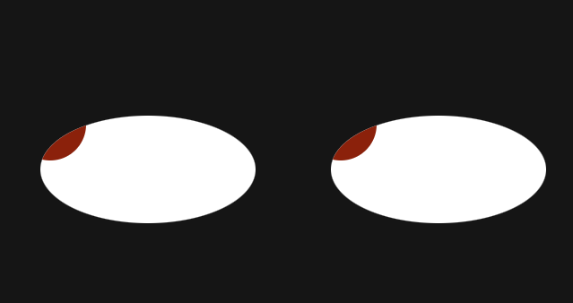

# Eyes

## Description
Using JavaScript and eventlisteners to track the cursor through the screen, updating its position dinamically.

## How to Run
To run this kind of project you'll have to download ALL the files that are in this repository and then run the Index.html file in a web browser that supports JavaScript code.

## Tools

* javaScript
* Html
* CSS

# RoadMap To Improvement

* Make an css animation that makes the eye blink after a certain time.
* Make an css animation + js audio that makes a sound as he was saying 'are you there?' if the mouse be still for a while.

